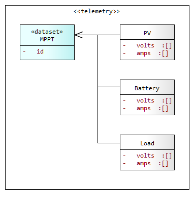

# monitoring.mppt
---

# Source system



--- 

# Dataset structure 

While the request message structure described above is optimised to reduce size, the dataset structure is optimised to simplify queries for analytics. 

In particular the arrays in the request message structure are flattened and transformed into the following dataset structure, which includes additional elements.

- The added timestamps are based on `time_local` sent in the request message, which is replaced by these timestamps.  

- The timestamps are stored in the canonical format used for data storage ('YYYY-MM-DD HH:mm:ss.SSSS') as shown in the examples.

Attribute | Metric | Data | Constraint | Description
--- | --- | --- | --- | ---
`mppt_id` | - | string | - | Id of the MPPT charge controller. This attribute replaces `mppt.id` in the request message.
`pv[nn].volts` | volts | float | - | The value of the element corresponding to nn in the request `pv.volts` array.
`pv[nn].amps` | amps | float | - | The value of the element corresponding to nn in the request `pv.amps` array.
`pv[nn].watts` | watts | float | - | The product of `pv.volts` and `pv.amps`.
`battery.volts` | volts | float | - | _(no change from request message)_.
`battery.amps` | amps | float | - | _(no change from request message)_.
`battery.watts` | watts | float | - | The product of `battery.volts` and `battery.amps`.
`load[nn]` | - | object *(array)* | - | The `load` array contains elements which correspond to `load.volts[nn]` and `load.amps[nn]` in the request message.
`load[nn].volts` | volts | float | - | The value of the element corresponding to nn in the request `load.volts` array.
`load[nn].amps` | amps | float | - | The value of the element corresponding to nn in the request `load.amps` array.
`load[nn].watts` | watts | float | - | The product of `load.volts` and `load.amps`.
`bus_connect` | _ok/fault_ | integer | 1/0 | A boolean status indicating whether the device's data bus is connected or faulty. Corresponds to bit __0__ in the binary-decoded request `status`.
`sys.source` | - | string | - | The identifier of the data sender, based on the API key sent in the request header. The value is a foreign key to the `system.source` dataset table, which provides traceability, and data provenance for data received through the API endpoint.
`time_utc` | - | datetime | - | The UTC time of the event which produced this data sample.
`time_local` | - | datetime | - | The local time of the event which produced this data sample. Note that the timezone offset is discarded.
`time_processing` | - | datetime | - | The UTC time when the request was received and *processed* on the API host.

### Equipment status attributes 

The dataset includes the following status atrributes which are based on the hex-encoded request `status`.

Attribute | Metric | Data | Constraint | Description
--- | --- | --- | --- | ---
`bus_connect` | _ok/fault_ | integer | 1/0 | The devices's `Bus Connectivvity` status. Indicated whether the device's data bus is connected or faulty. Corresponds to bit __0__ in the binary-decoded request `status`.


### Transformed JSON message

The transformed JSON structure is shown in the followng sample. This structure is sent to the message broker at the first stage of processing the `dataset/mppt` POST message, and later used to load data into the datawarehouse:

```
*** MESSAGE ***
Topic: mppt
Key: IT6415AD-01-001
Value:	
```

```json
{
    "mppt_id": "IT6415AD-01-002",
    "pv": [
        {"volts": 48, "amps": 6, "watts": 288 },
        {"volts": 48, "amps": 6, "watts": 288 } ],
    "battery": {"volts": 55.1, "amps": 0.0, "watts": 0 },
    "load": [ 
        { "volts": 48, "amps": 1.2, "watts": 57.6 },
        { "volts": 48, "amps": 1.2, "watts": 57.6 } ],
    "status": { "bus_connected": 1 },
    "sys": {"source": "S000" },
    "time_utc": "2019-02-09 08:00:07.0320",
    "time_local": "2019-02-09 15:00:07.0320",
    "time_processing": "2019-09-10 04:13:08.8780"
},
```

### Partitions and clustering

__mppt__ dataset tables are partitioned based on `time_local` and clustered by `mppt_id`.